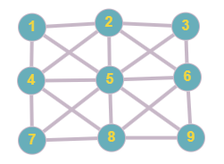

```
███╗   ███╗ █████╗ ████████╗██████╗ ██╗██╗  ██╗   ██████╗ ██████╗  █████╗ ██████╗ ██╗  ██╗██╗███████╗██╗   ██╗
████╗ ████║██╔══██╗╚══██╔══╝██╔══██╗██║╚██╗██╔╝  ██╔════╝ ██╔══██╗██╔══██╗██╔══██╗██║  ██║██║██╔════╝╚██╗ ██╔╝
██╔████╔██║███████║   ██║   ██████╔╝██║ ╚███╔╝   ██║  ██╗ ██████╔╝███████║██████╔╝███████║██║█████╗   ╚████╔╝ 
██║╚██╔╝██║██╔══██║   ██║   ██╔══██╗██║ ██╔██╗   ██║  ╚██╗██╔══██╗██╔══██║██╔═══╝ ██╔══██║██║██╔══╝    ╚██╔╝  
██║ ╚═╝ ██║██║  ██║   ██║   ██║  ██║██║██╔╝╚██╗  ╚██████╔╝██║  ██║██║  ██║██║     ██║  ██║██║██║        ██║   
╚═╝     ╚═╝╚═╝  ╚═╝   ╚═╝   ╚═╝  ╚═╝╚═╝╚═╝  ╚═╝   ╚═════╝ ╚═╝  ╚═╝╚═╝  ╚═╝╚═╝     ╚═╝  ╚═╝╚═╝╚═╝        ╚═╝   
```

@JC-Xander<br>
@version: 0.0.2<br>
@since:  2024/10/18<br>
@date: 2024/10/18

Convertir una matriz de datos en un grafo el cual permita encontrar rutas tanto en diagonales como en verticales, aparte podemos usar los valor de la matriz para gestionar un grafo de peso o usar tuplas(@value, @peso) donde @value es el valor que almacenara el nodo y value el peso del del nodo, y buscar diferentes rutas.

# USO
```py
    from matrixgraphify import Graph

    MATRIZ = [
        [1, 2, 3],
        [4, 5, 6],
        [7, 8, 9]
    ]

    graph = Grapk(MATRIZ)

```
con esto crearemos un grafo con los valores de las matrix donde se conectaran de esta forma.
<div width=100% align=center>
    
</div>

# Funciones primarias
- Enum dirección el cual permite establecer la hubicacion del nodo que queremos añadir, o la hubicación del nodo al que nos dirigimos
- Establecer un enum el cual indique un camino bloqueado por el cual no habra paso
- Bucar el camino mas corto de un punto A a un punto B representados por 2 coordenas (x,y)
    - Busqueda solo son los elemento horizontales
    - Busqueda solo con loe elementos verticales
    - Buscada con todos los elementos adyacentes
- Buscar el camino con menos peso si es una matriz con valores
- Buscar el camino mas corto(sin repetir)
- Buscar el camino mas largo(sin repetir)

# Estructuración
- Clase Node: Sera la clase base, esta formara los nodos del grafo y en ellos se alamacenara toda los datos con el valor a alamcenar y sus vertices
- Clase grafp: Esta sera la encargada de realizar todas las conexiones correspondientes segun los datos en la matriz creara una matriz de nodo y luego realizara la unión de los mismos.

